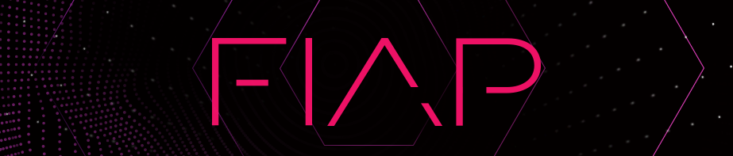

<p align="center">

</p>

# <center>Me aluga aí 🗃️</center>

Este é um projeto onde representa uma inovadora aplicação que visa a promover ativamente a cultura de compartilhamento e locação de itens entre os usuários. 
A finalidade primordial é mitigar os impactos do consumo excessivo e, simultaneamente, fomentar a sustentabilidade e a economia para o usuário. 

---
## 📝 Tecnologias
* Nest
* React 
* Swagger
* Prisma ORM
* Postman

## 📄 Documentação 
Foi utilizado Swagger para realizar a documentação e modelagem dos endpoints do projeto, pensando em ajudar futuramente a utilização da API. Onde pode ser acessado na URI:
```
localhost:3000/api
```
PROD:
```
https://mealugaaiapp.cyclic.app/api
```

## 🧑‍💻 Como rodar o projeto
Após clonar o repositório em sua máquina rode o comando abaixo: 
<br />
<br />
Backend
```
npm start dev
```
<br />

Frontend
```
npm run dev
```

## ✨ Postman
Utilize a collection _mealugaai-api.postman_ presente no projeto, para importar e testar os endpoints no Postman. 

___
